## 任务介绍：

如下地图，会随机产生5个障碍物。挑战者需要规划出一条无碰撞的路线，引导小车从起点跑到终点。期间无碰撞且完成时间越短越好。


## 提供材料：

### sysu_standard.mat

是验收标准3中所述的给定的跑圈地图（完成时间越短越好），**地图尺寸和障碍物位置均不得改变**，如在ROS中实现，可以使用不同数据结构，但是栅格划分需保持一致。

这个文件有两个数据，一个是map一个是out。

map是非0即1的600×1200的二维数组，0代表未被占据，1代表被占据，对应实际地图宽6m， 长12m。

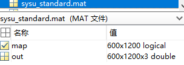

通过imagesc和colormap显示如下。

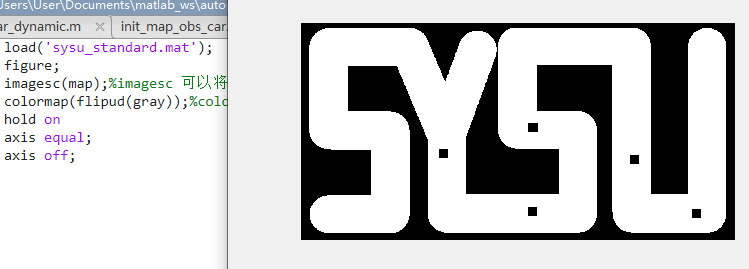

### traj_diySYSU.mat

助教通过对hybrid astar规划出的轨迹进行采样和相应处理，获得了散点轨迹，其中包含x y phi 曲率的信息。显示其中xy信息如下。


规划部分出于效率考虑建议写在simulink以外，编写方式不限，能满足simulink里控制器的需要即可。

同学需要自己编写轨迹规划的代码， 起始点和终止点信息如下：

```
start_pos=[0.8,0.8];%m 起点在simulink文件的状态更新模块中已设定，不可更改。
goal_pos=[11.3,4.5];%m 终点在终点判定模块中已设定，不可更改。
```

在验收标准中有要求同学们提供给定该图跑完全程的动图，不许使用助教这份现成的轨迹，请自行编写规划代码获得轨迹数据。

### sysu6001200.png

被preprocessing.m调用，用来生成原始无障碍物赛道地图

### preprocessing.m

  这份代码是预处理的参考代码，其中读入了png图片，shrink_race_track函数可以把赛道缩窄，gen_obstacle可以生成随机障碍物。 验收时会要求自行生成6张随机障碍物图并跑圈，助教会测试代码确认针对更多的障碍物地图具有避障效果。

  为评分公平，**这部分代码不得改动**。（如果生成位置太狭窄不理想你可以多生成几次但是代码和参数均不得改动。）

  生成之后函数将把被占据的设为000黑色，非占据设为111白色，生成600×1200×3的三维数组out。也就是sysu_standard.m里out的来源，它将输入给simulink显示部分使用。

### car_sim_for_student_r2015.slx

#### simulink操作介绍

提供的simulink模块有，小车的状态更新模块,显示模块, 记时和判定抵达模块。

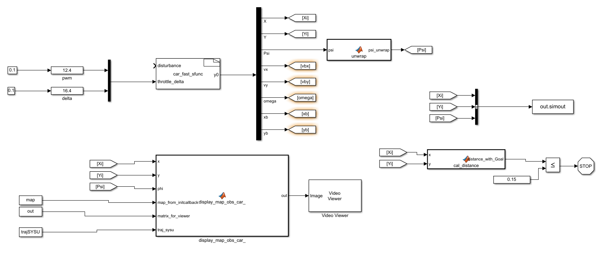

首先介绍一下simulink的一些基本操作，如果在模型设置的回调部分，initfcn写上你的.m文件名，则会在点击运行后首先执行这个文件，你可以在这个自定义的初始化文件中load地图信息，load你的之前规划好的轨迹，所以这需要你先将规划好的轨迹保存成你定义的数据格式，比如助教的traj_diySYSU就包含自己控制器需要的信息：x,y,psi,曲率。你可以选择在开始simulink的控制仿真时load进去，也可以把轨迹规划部分放进simulink里，但是为了方便单个模块调试不太建议，因为如果你搜索时地图分辨率没有降低的话，会比较耗时）

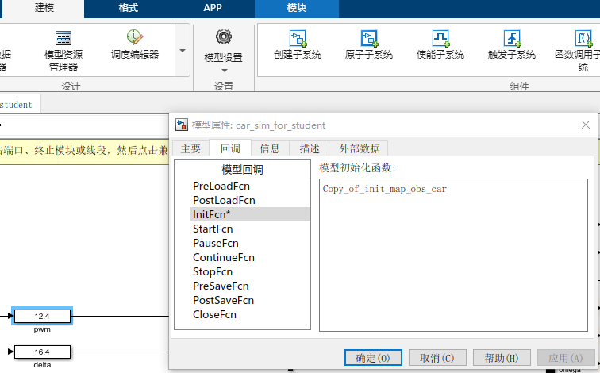

如果初始function简单也可以直接写在这里 ,注意需要在一个路径下

  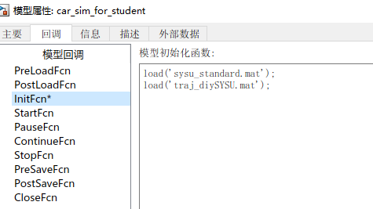

stopfcn则是在运行完毕之后会调用的.m文件

对于你的一些状态量，使用out.simout来记录。你所显示的小车运行的总时间需要从这里获得。

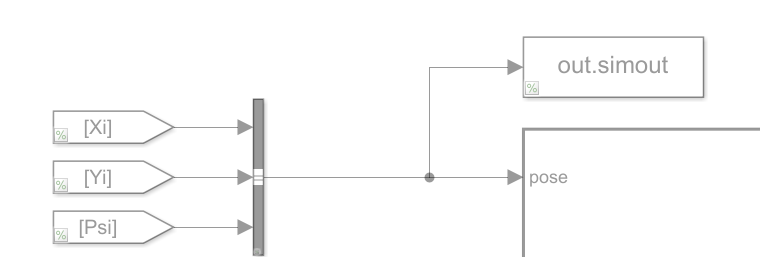

它记录的数据是包含时间序列的，也就是仿真进行时这几个量的每一个状态都会被记录下来。在你定义的stopfcn里可以使用类似的如下命令导入你的数据状态数组

```
x_data = out.simout.X.Data;
y_data = out.simout.Y.Data;
psi_data = out.simout.psi_unwrap.Data;
```

通过这种方式，你可以将小车的行驶轨迹记录下来。


#### 状态更新模块

**该部分不得更改**

即car_fast_sfunc，这里是小车的仿真模型，通过sfunc实现，这个模块全部不得更改。右侧栏的连续状态IC表示初始状态,**0.8 0.8是小车起始位置，不得改变**

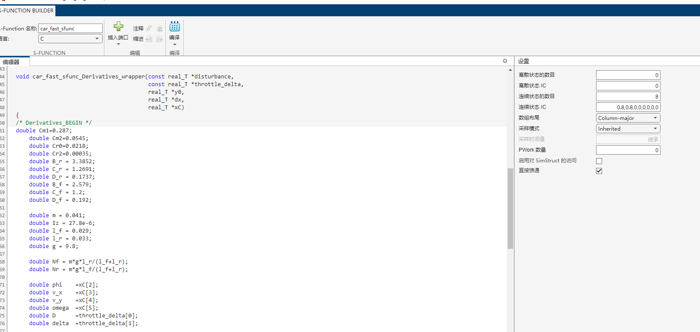

这里需要c的编译器，建议使用mingw, mingw大家需要的版本各不相同，根据自己matlab版本定，就没有放进文件夹，需要同学们搜搜怎么配置给matlab，下载链接可以从下面这个下

https://sourceforge.net/projects/mingw-w64/files/

#### 显示模块

这个模块提供给同学们调试使用。它会载入map地图信息和三维数组out，以及输入了x，y，psi即可显示小车。

由于在simulink中好像不能用plot函数（我反正没成功），这里用的videoviewer，它的image输入需要是一个三维数组，第三个维度是rgb通道信息，这也是为什么前面提供的sysu_standard.mat需要有out这个数据。这个模块可以边运行边显示，但是出于时间考虑，可以把它注释掉，在你定义的stopfcn里来显示你跑完全程的轨迹。

为了方便调试，提高simulink运行速度，可以阅读一下显示模块的代码，把地图改成分辨率低的。

由于这个车的模型参数所限，它确实是不给输入也会倒退的。

小车判定出界后会报错，不想报错可以自己修改。

模块代码里这个是为了在地图上显示你输入的轨迹，你在自己测试时要是觉得每次仿真步长里都要遍历一遍太费时间，可以在初始化导入的sysu_standard.mat里把out数据改掉。

```
    number_path=size(traj_sysu,2);
    for tmp=1:number_path
        traj_sysu_index=real2map([traj_sysu(1,tmp),traj_sysu(2,tmp)],map_wide,resolution);
        out(round(traj_sysu_index(1)+1/2),round(traj_sysu_index(2)+1/2),:)=[0,0,0];
    end
```

#### 控制模块

你需要自己搭建。小车模型状态是x y psi vx vy omega xb yb，输入是油门和舵角。 文件中提供了两个滑块可以调节实时输入，作为控制演示。

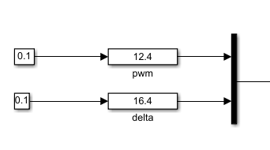

#### 判定抵达和记时

**该部分不得更改**

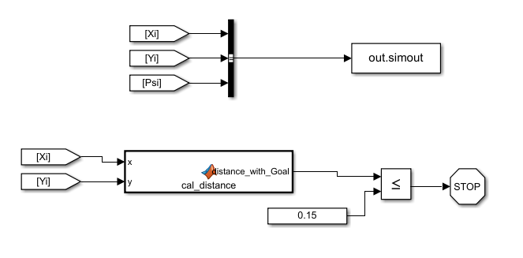

## 方案参考：

### 助教的方案

规划只有前端：hybrid astar

代码参考 https://github.com/HKUST-Aerial-Robotics/Fast-Planner/tree/master/fast_planner/path_searching/src

效果：


使用的是matlab写的，为了速度将地图分辨率降低后进行的规划。

控制器:横向控制LQR，纵向控制PID。效果见开头动图。

首先规划出轨迹，hybridastar规划出来的一个个节点具有位置和速度信息，以及通过怎样的加速度抵达至此的信息。由于助教的控制器除了位置信息还需要psi和曲率，便将轨迹（一堆有信息的节点）处理成x y psi 曲率的数据，保存成了traj_diySYSU这个文件，在simulink的初始化function中，将sysu_standard和traj_diySYSU导入。

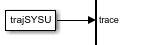

有了需要的轨迹信息，就据此搭建控制器，先找到距离当前位置最近的轨迹点，计算横向位置误差，速度误差，psi误差，角速度误差，以此构建LQR控制器，结合期望曲率的前馈，输出舵角量。

油门量则根据当前纵向速度和预设的期望速度使用pid进行控制。

油门量和舵角量输入给状态更新模块即可。动图显示在自定义的stopfunction里完成

### 其他参考方案

#### 规划前端

为了减少代码运行时间同学们可以在规划时降低地图分辨率

```
 m = matfile('sysu_standard.mat');
 before_map=m.map;
 map = imresize(before_map,0.2);
```


##### 1.astar    

代码参考fastplanner的前端

https://github.com/HKUST-Aerial-Robotics/Fast-Planner/tree/master/fast_planner/path_searching/src

效果

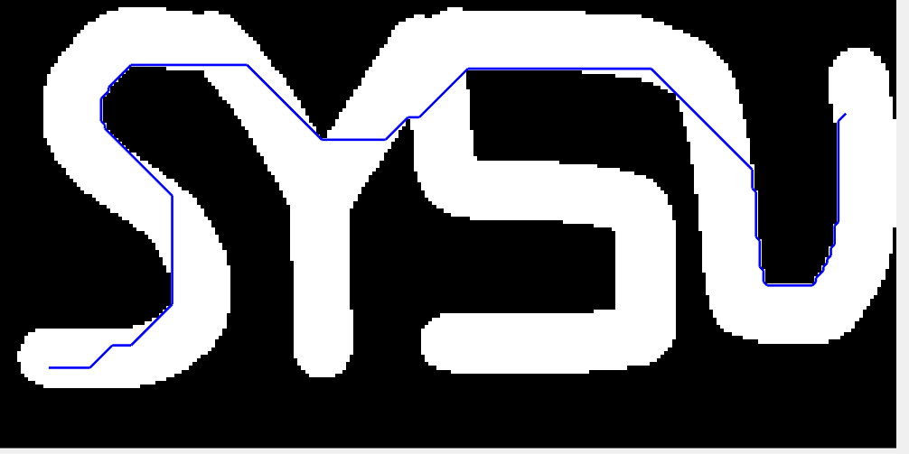

使用时注意为了安全，可以根据小车的尺寸膨胀一下障碍物。

##### 2.PRM    

代码参考fastplanner的前端

https://github.com/HKUST-Aerial-Robotics/Fast-Planner/tree/master/fast_planner/path_searching/src

##### 3.rrtstar，kinodynamicRRT

论文参考  Kinodynamic RRT*: Optimal Motion Planning for Systems with Linear Differential Constraints

https://arxiv.org/abs/1205.5088

#### 规划后端

##### 1.bspline和esdf进行后端优化

同样代码参考fastplanner，https://github.com/HKUST-Aerial-Robotics/Fast-Planner/tree/master/fast_planner

但涉及到需要非线性优化，在simulink里可能实现困难，不建议在simulink中实现。

##### 2.corridor加bezier曲线

代码参考https://github.com/HKUST-Aerial-Robotics/Btraj


#### 控制部分

可以使用mpc，mpcc等

参考代码 https://github.com/alexliniger/MPCC

参考文章 ：  Optimization-based autonomous racing of 1:43 scale RC cars

## 验收标准：

1. 显示要求：规划轨迹、小车实际轨迹、用时（是仿真时间中的用时，从simulink的out.simout里获取，在simulink操作介绍里有讲）、起点、终点

2. 提供6张不同随机地图的跑完全程的动图，动图实时显示规划轨迹、小车当前位置和驾驶用时；

3. 提供给定跑圈地图跑完全程的动图，动图实时显示规划轨迹、小车当前位置和驾驶用时；

4. 要求一套参数实现验收标准2和标准3。

## 评分标准

1. 提供不超过3页的实验报告（报告首先呈现上述6个随机地图+1个跑圈地图完成情况的截图，再说明实现方案），同时提供7个gif图，源代码；

2. 避障功能得分：规划路线与实际路线不能有碰撞，按碰撞次数扣分；40%

3. 快速性得分：成绩按小车用时排名，使用ROS写的同学单独排名并且排名在所有使用matlab同学前面。60%

4. 助教测试提交代码，测试结果与报告出入过大按作弊处理

5. **不管最后是否完成任务，按时提交报告并写明尝试过的方案，就不会挂科！！！！！！！**


## ROS

用ROS写代码的同学，评分排名在所有使用matlab同学前面。（但如果多位同学都使用ros，内部也分排名）

同学需要自行搭建小车的仿真平台。（其实也就是状态更新和显示）

车辆模型如下，车辆状态变量为x y psi vx vy omega xb yb， 输入是油门和舵角即D，delta，车辆的参数模型不可以改变

```
    double Cm1=0.287;
    double Cm2=0.0545;
    double Cr0=0.0218;
    double Cr2=0.00035;
    double B_r = 3.3852;
    double C_r = 1.2691;
    double D_r = 0.1737;
    double B_f = 2.579;
    double C_f = 1.2;
    double D_f = 0.192;
        
    double m = 0.041;
    double Iz = 27.8e-6;
    double l_f = 0.029;
    double l_r = 0.033;
    double g = 9.8;
    
    double Nf = m*g*l_r/(l_f+l_r);
    double Nr = m*g*l_f/(l_f+l_r);
    
    double phi    =xC[2];
    double v_x    =xC[3];
    double v_y    =xC[4];
    double omega  =xC[5];
    double D      =throttle_delta[0];
    double delta  =throttle_delta[1];
    
    double alpha_f = atan2((l_f*omega + v_y), abs(v_x))-delta;
    double alpha_r = atan2((v_y-l_r*omega),abs(v_x));
    double F_fy = D_f*sin(C_f*atan(-B_f*alpha_f));
    double F_fx = -Cr0*Nf-Cr2*v_x*v_x;
    double F_ry = D_r*sin(C_r*atan(-B_r*alpha_r));
    double F_rx = (Cm1*D-Cm2*D*v_x-Cr0*Nr-Cr2*v_x*v_x);
    
    dx[0] = v_x*cos(phi) - v_y*sin(phi);
    dx[1] = v_y*cos(phi) + v_x*sin(phi);
    dx[2] = omega;
    dx[3] = 1/m*(F_rx + F_fx*cos(delta) - F_fy*sin(delta) + m*v_y*omega);
    dx[4] = 1/m*(F_ry + F_fx*sin(delta) + F_fy*cos(delta) - m*v_x*omega);
    dx[5] = 1/Iz*(F_fx*sin(delta)*l_f + F_fy*l_f*cos(delta)- F_ry*l_r);
    dx[6] = v_x;
    dx[7] = v_y;
```

模型状态更新可以使用龙格库塔等方法，需要自行将每次更新状态的时间dt加起来，最后积累你的总时间。

模型状态更新参考：https://github.com/alexliniger/MPCC/blob/master/C%2B%2B/Model/integrator.cpp

地图和matlab同学一致，使用sysu_standard.mat文件

